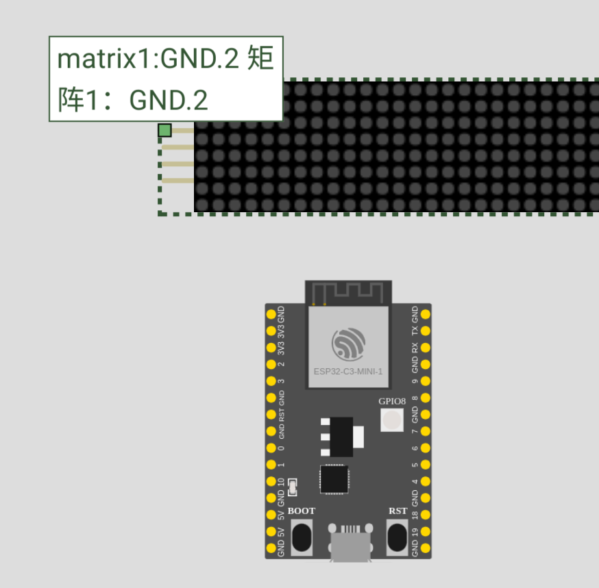
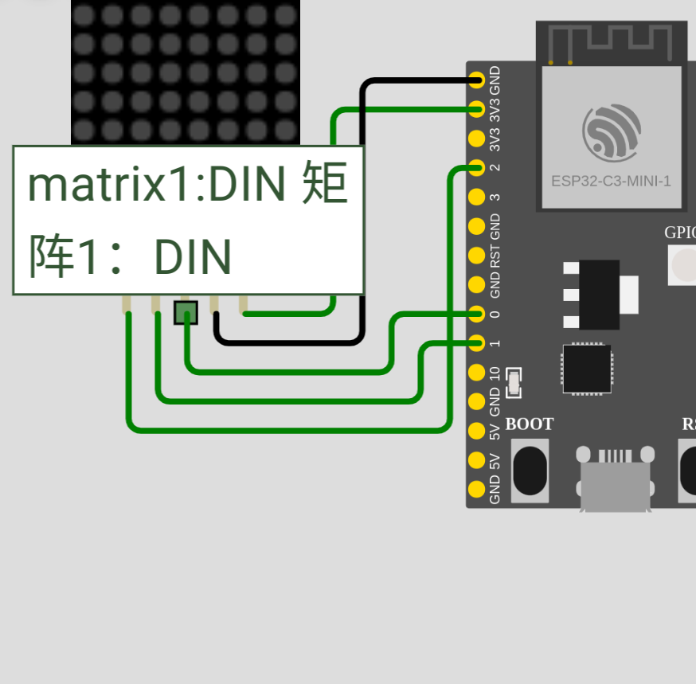
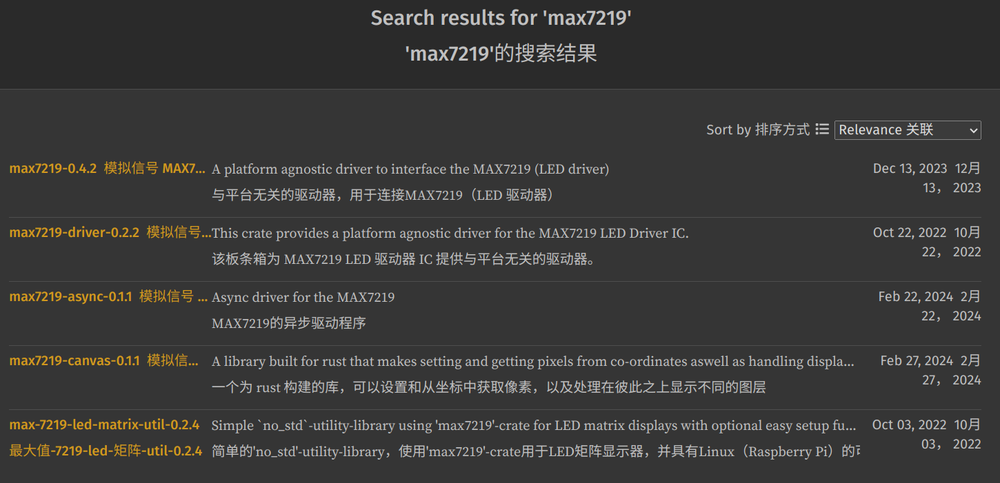
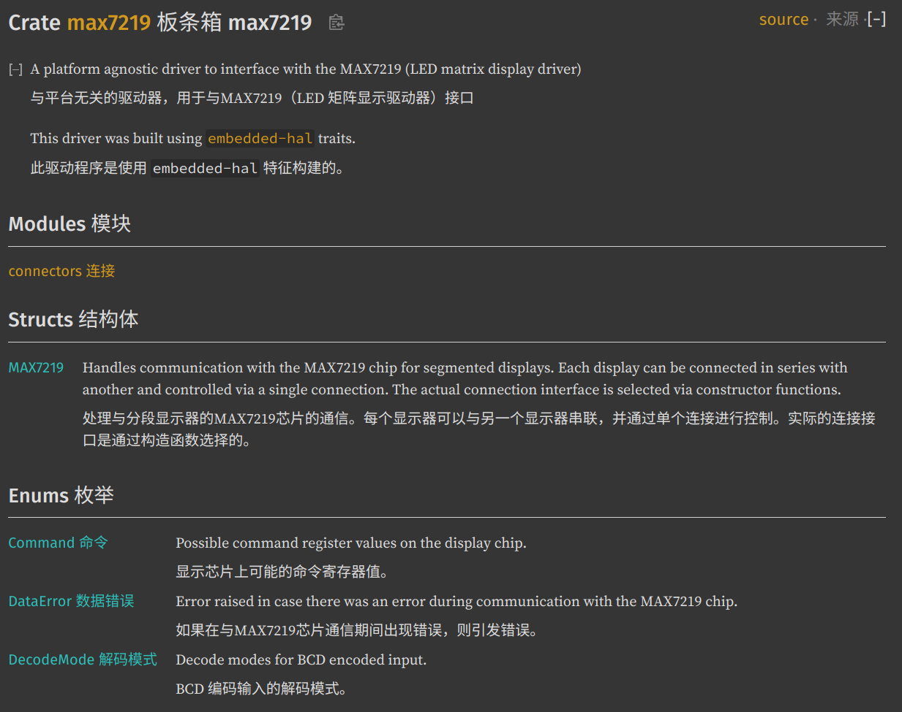
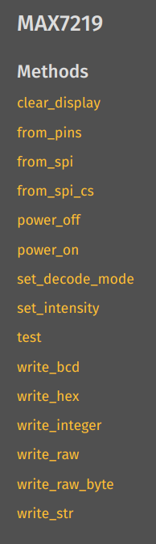

# `esp32` 点亮LED

本文将借助在线模拟平台模拟`esp32c3`控制一个`8x8 LED`矩阵。

## 硬件部分

仿真平台为https://docs.wokwi.com/zh-CN/，这个网站并非依托后端程序构建的仿真，而是直接使用前端编程的仿真，所以仅能做一些数字电路的尝试，可选的硬件也是有限的，但好处就是项目配置方便，安卓系统也能用。总结来说非常适合教学。

控制`LED`的原理是单片机控制一个引脚上的电位来在`LED`电路中实现开关等功能。所以我们先来了解以下所使用的硬件：`wokwi-max7219-matrix Dot Matrix`。

首先我们可以在https://docs.wokwi.com/parts/wokwi-max7219-matrix#matrix-layout看到引脚功能。

| Name 姓名 | Description 描述        |
| --------- | ----------------------- |
| `VCC`     | Voltage supply 供电电压 |
| `GND`     | Ground 地面             |
| `DIN`     | Data input 数据输入     |
| `CS`      | Chip Select 片选        |
| `CLK`     | Clock input 时钟输入    |
| `DOUT`    | Data output 数据输出    |

鼠标悬浮在引脚上时可以看到引脚标签：



其中，`DOUT`用于串联多个LED矩阵，现在展示不考虑。`DIN`和`DOUT`分布在不同侧，我们需要将DIN侧的所有引脚连接到单片机上，`DIN` `CS` `CLK`我分别连接了0 1 2。如图所示：



## 软件部分

对应现实世界中，我们刚刚完成了在硬件之间连接线缆。但对于硬件的一些控制细节我们还一无所知，一般情况下我们可以去查看硬件的规格书。但在实际编程中其实有一些捷径可以走，简单来说，我们可以从代码中去了解硬件的功能。首先我们从之前提到的手册中可以得知，控制该`LED`矩阵本质上是控制一个名为`matrix7219`的芯片。在了解到这一信息后，按照`rust`编程的惯例，我们应该去看看有没有第三方库能作为驱动库供我们使用，在https://docs.rs/中搜索`matrix7219`我们可以得到以下5个结果：



> 软件开发取一个好名字十分重要，在这里我们选择第一个。

之后就是阅读代码。好在我们随便选择的代码不算复杂，这是他的源码结构：



从这里我们可以看到操纵该硬件主要使用同名结构体`MAX7219`，该结构体实现了这些方法：



仅从方法名我们还看不出哪个是`MAX7219`的构造函数，但这里有一个技巧，我们可以遍历函数的返回值，只要返回值为`Self`。那就充当了构造函数的作用。遍历的结果发现返回值包含`Self`的函数分别为`from_pins`、`from_spi`和`from_spi_cs`。这三个函数从名字可以看出提供了三种不同的构造方式，我们拿第一个举例，它比较简短，我们可以尝试使用自然语言翻译一下：

```rust
1 impl<DATA, CS, SCK> MAX7219<PinConnector<DATA, CS, SCK>>
2 where
3     DATA: OutputPin,
4     CS: OutputPin,
5     SCK: OutputPin,
6 {
7     pub fn from_pins(displays: usize, data: DATA, cs: CS, sck: SCK) -> Result<Self, DataError> {
8         MAX7219::new(PinConnector::new(displays, data, cs, sck))
9     }
10}
```

* 第一行首先声明了三个泛型`<DATA, CS, SCK>`，下面将为泛型`CONNECTOR`为`PinConnector<DATA, CS, SCK>`的`MAX7219<CONNECTOR>`实现函数。
* 第二行到第五行分别解释了之前说的三个泛型`<DATA, CS, SCK>`都需要满足`OutputPin`这一`trait`（一译作特性）。该特性在前面声明：`use embedded_hal::digital::v2::OutputPin;`该库由`rust`官方嵌入式工作组维护，意在统一不同平台下同一功能的相关编程标准。
* 第七行来到了函数的具体实现，它需要4个参数，分别是`disply`，代表串联的显示屏设备数量（由注释得知），剩下三个是泛型，只要是满足了`OutputPin`的数据类型都可以作为参数。最后返回一个`Result<Ok, Err>`枚举，该枚举表示函数执行结果有两种可能，即返回两种数据结构，一种放在了`Ok`的位置，就是一个`MAX7219<PinConnector<DATA, CS, SCK>>`；另一种可能为`DataError`，这是库自己实现的一个错误类型，它本质也是一个枚举，该枚举有两种变体，一个是`Spi`，代表`SPI`工作错误，一种是`Pin`以此类推（由注释得知）。现在我们了解了之前提到的三个泛型的作用，他们组成了一组`SPI`通信引脚。
* 第八行是函数的具体执行细节，这个展开来讲会比较复杂而且在掌握了`rust`的基础知识后是一目了然的，这里就不多赘述。

上面这些不单单是在介绍`rust`的语言特性，作为嵌入式开发工程师，在使用`rust`进行编程时需要了解这样一种行业约定。一般我们实现一个固件，必须基于某一特定操作系统或是硬件环境，的那在`rust`中是通过一个官方库来约定这一行为。可以拿传统面向对象编程来理解，即官方给出类，库开发者和单片机`hal`开发者写的是修饰器。

回到项目，现在我们知道了，只要我们能得到三个数据类型，它们的组合需要实现了`SPI`的写功能。这是和`esp32c3`相关的内容，我们可以选择去读它`hal`库的源码，也可以又走一条捷径。有些时候开源库的开发者会在仓库中放置一些测例(`test mod`)或者样例(`example`)。前者是用于验证代码时候正常工作，但一个`crate`中包含了`test`模块时，`docs.rs`会在他们的服务器上在所有已选择的操作系统上运行这些单元测试。后者是面向用户的代码，在`crate`的根目录下运行`cargo run --example={name}`在用户的设备上运行该代码。在严格规范的代码当中，`test`是面向`mod`层，即每一个`mod`应该包含对应的`test`。否则是面向库的，一个库有几个`example`。下面是https://github.com/esp-rs/esp-hal 的代码。在今年年初乐鑫将旗下所有单片机的各个`hal`库合并到了`esp-rs/esp-hal`当中，使用库的`features`指定目标设备，所以`example`也迁移到这里。这里的解读会比较多，我放在了注释当中：

```rust
let peripherals = Peripherals::take();// Peripherals可以理解为外设工作对象，它实现了一个引用锁，rust支持在嵌入式设备上异步执行命令，所以保证寄存器读写操作的原子性十分重要。
let system = peripherals.SYSTEM.split();// spi需要时钟源，这是时钟源的控制对象，这里的split表示从Peripherals上分离SYSTEM的控制权
let clocks = ClockControl::boot_defaults(system.clock_control).freeze();//时钟复位

let io = IO::new(peripherals.GPIO, peripherals.IO_MUX);//文档中表示这是通用输入/输出驱动器
let sclk = io.pins.gpio0;//从其中创建对应引脚的控制对象 p0
let miso = io.pins.gpio2;//p2
let mosi = io.pins.gpio4;//p4

let mut spi = hal::spi::Spi::new(//创建spi控制对象，在文档中我们可以看到该对象实现了Write<u8>所以我们可以直接用它创建MAX7219控制对象。
    peripherals.SPI2,
    100u32.kHz(),
    SpiMode::Mode0,
    &mut peripheral_clock_control,
    &mut clocks,
).with_pins(Some(sclk), Some(mosi), Some(miso), Some(cs));
```

下面给出实现一个流水灯的代码：

```rust
#![no_std]
#![no_main]

use esp_backtrace as _;
use esp_hal::{clock::ClockControl, peripherals::Peripherals, prelude::*, IO};
use max7219::MAX7219;

#[entry]
fn main() -> ! {
    let peripherals = Peripherals::take();
    let system = peripherals.SYSTEM.split();
    let clocks = ClockControl::boot_defaults(system.clock_control).freeze();

    let io = IO::new(peripherals.GPIO, peripherals.IO_MUX);
    let (sck, cs, data) = (
        io.pins.gpio0.into_push_pull_output(),
        io.pins.gpio3.into_push_pull_output(),
        io.pins.gpio2.into_push_pull_output(),
    );

    let mut max7219 = MAX7219::from_pins(1, data, cs, sck).unwrap();
    let mut delay = esp_hal::delay::Delay::new(&clocks);
    max7219.power_on().unwrap();
    loop {
        let mut raw = [0 as u8; 8];
        for i in 0..8 {
            for ii in 0..8 {
                max7219.write_raw(0, &raw).unwrap();
                delay.delay_ms(500u32);
                raw[i] = raw[i] + 2u8.pow(ii);
            }
        }
    }
}
```

运行效果见附件视频，也可以点击下面链接在浏览器内自己运行仿真。https://wokwi.com/projects/392706923960765441
